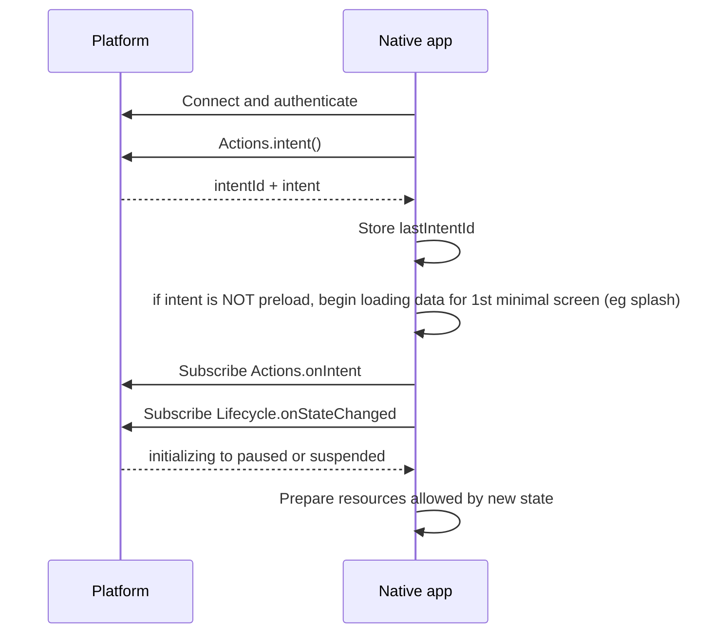
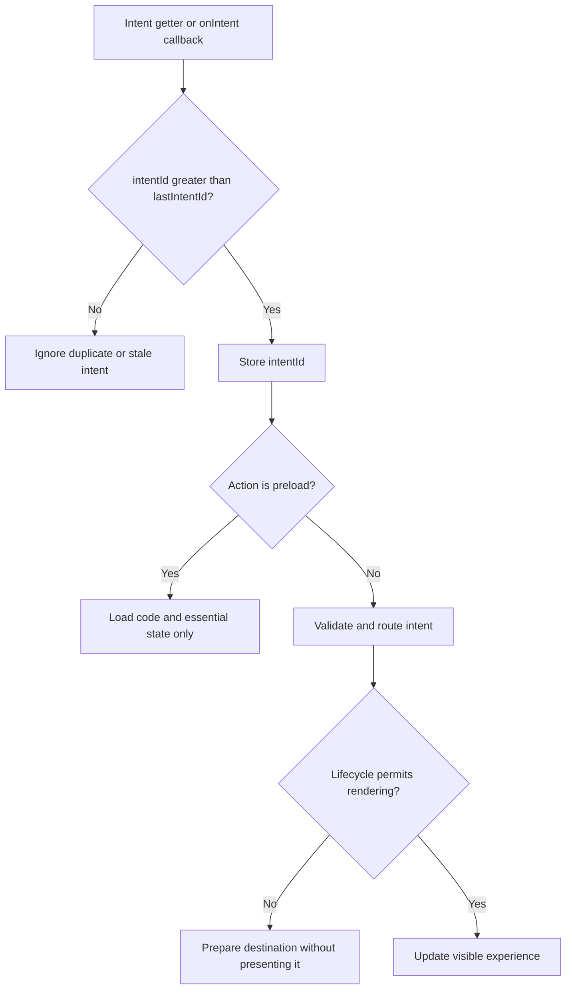

# Lifecycle and Intents for Native Firebolt Apps

**Lifecycle 2.0** defines when a native Firebolt app can use CPU, graphics, audio/video, memory, and network resources. **Intents** tell the app which experience to prepare when those resources are available.

The primary purpose of the Application Lifecycle on the platform is to enable fast application startup, resume, and switching, while ensuring robust platform operation and efficient resource utilization.

The platform owns lifecycle transitions. Your responsibilities as native app or runtime are:
**subscribe to lifecycle changes during startup, allocate only the resources allowed in each state, consume the newest intent, and release resources promptly when the app is deactivated or suspended.**

This page focuses on the native application or runtime integration steps. For the lifecycle model and the reasons behind each state, refer to the Lifecycle 2.0 specification.

---

## Native API surface

Use the following APIs for Lifecycle 2.0 onboarding:

| Module | API | App responsibility |
|---|---|---|
| `Lifecycle` | `onStateChanged` | Subscribe during startup and use notifications as the primary source of lifecycle state. |
| `Lifecycle` | `state` | Read the current state only when recovery or diagnostics require it. |
| `Lifecycle` | `close` | Ask the platform to deactivate, unload, or restart the app. |
| `Actions` | `intent` | Read the most recently received intent, including its monotonic `intentId`. |
| `Actions` | `onIntent` | Subscribe to intents delivered while the app has CPU. |

> [!IMPORTANT]
> Use the app-facing `Lifecycle` module for all Lifecycle 2.0 APIs.

---

## Startup contract

A native app starts in `initializing`. It remains there until it subscribes to `Lifecycle.onStateChanged`. Treat that subscription as the lifecycle handshake with the platform.

During cold launch or preload:

1. Read and use the environment variables provided by the AppContainer to initialize and configure your application. While in `initializing` state you can load resources such as code libraries and data files locally and via network but you **MAY NOT yet allocate an EGL surface, GPU resources or an active AV session via Rialto**. 
2. Load the `firebolt-cpp-client` library and connect ASAP to the endpoint specified by `FIREBOLT_ENDPOINT` env var. `Firebolt::IFireboltAccessor::Instance().Connect(...)` Upon successfull connection you can now talk with Firebolt AppGateway by using the Firebolt api
3. Start with calling Firebolt `Actions.intent()` api and store its value and the returned `intentId` as the last received ID. The possible Intents values and their meaning are defined in [Intents Spec](https://wiki.rdkcentral.com/spaces/WG/pages/507518406/Firebolt+9+Intents+Specification). If the intent value is `preload`, it is a strong indication, though not an absolute guarantee, that the platform will soon transition the app to the `suspended` state (through the in step 6 upcoming onStateChanged event). If the intent value is neither preload nor absent, the platform likely intends to launch the application on the screen rather than preload it, though no guarantee. To help accelerate startup, we recommend using this opportunity to begin **loading the data resources required for the initial splash screen** or first minimal UI presented by the application. Note that rendering the splash screen is not yet permitted in this lifecycle state; only the loading of data resources in preparation for rendering is allowed.
Some intents represent **deep-links** to a specific view, section, or entity within the app. If available at this early stage in the startup flow, such deep-link type of intent is an indication, though no guarantee, that platform aims or intends to launch this app to the screen (with the particular deep-link view). In the usual - good case - app launch flow from cold startup to the screen, the lifecycle states following initializing are `paused` and subsequently `active`, typically occurring in quick succession. As an application developer, you are expected to realize the full requested intent as quickly as possible throughout these states, while respecting the constraints imposed by their resource contracts. To help accelerate intent fulfillment, the intent data provided during this early initialization phase can already be used to load, or prioritize the loading of, the relevant data resources for the specific screen(s).
5. Subscribe to `Actions.onIntent` and and route newly received intents through the same intent handler. Different intents may be received throughout the lifetime of the application, including while the application remains in the same lifecycle state. As App you need to get notified of such a intent change, so you can adapt accordingly and quickly (without needing to poll). An intent with an incremented ID invalidates the previous intent. While it is rather uncommon for the intent to change during the application's cold-start-to-screen flow, it is possible, and applications should be prepared to handle this scenario. 
6. Subscribe to `Lifecycle.onStateChanged`. For the platform, this subscription serves as the lifecycle handshake with the application.
7. Usually immediately after confirming this subscription method, the platform communicates the new Lifecycle state through an `onStateChanged` event. The new state is provided in the event payload. Follow the first transition from `initializing` to either `paused` or `suspended`. 

Reiterating, do not allocate an EGL surface, GPU resources, or an active AV session while still in `initializing`.

> [!TIP]
> Keep startup callback wiring independent of the graphics surface. A direct-to-suspended preload must be able to complete without creating that surface.

---

## Handle lifecycle state changes

`Lifecycle.onStateChanged` provides a list containing exactly one change with `oldState` and `newState`. The notification is raised after the platform has moved the app to the new state.

Use one state handler and make each operation safe to repeat:

~~~cpp
void onStateChanged(const StateChange& change)
{
	switch (change.newState) {
	case LifecycleState::Paused:
		enterPaused();
		refreshLatestIntent();
		break;
	case LifecycleState::Active:
		enterActive();
		refreshLatestIntent();
		break;
	case LifecycleState::Suspended:
		enterSuspended();
		break;
	case LifecycleState::Hibernated:
		enterHibernated();
		break;
	case LifecycleState::Terminating:
		enterTerminating();
		break;
	default:
		break;
	}
}
~~~

The type and registration names in generated bindings can vary by SDK version. Keep the behavior and ordering shown here when adapting the example to your client library.

### `initializing` to `paused`

Prepare the app for a normal launch:
- Transition is upon `Lifecycle.onStateChanged` event with payload "newState":"paused", "oldState":"initializing" 
- Load the Rialto Client lib and establish active communication session with Rialto Server but **do not start active Audio Video Session yet**.
- Subscribe to `Presentation.onFocusedChanged` so the application can be notified when it gains or loses focus. An application is only eligible to receive focus while in the `active` lifecycle state. However, it is important to subscribe before the transition to active occurs; otherwise, the initial focus event may be missed. Applications may subscribe as early as the `initializing` state.
- Using the Wayland client or essos library, create a full screen EGL surface or Vulkan surface.
- Prepare and render the first minimal but complete graphical screen and commit/present it to the display (for example, by calling eglSwapBuffers()) as soon as possible. This is typically a splash screen (recommended) or another lightweight startup screen and does not need to represent the experience requested by the intent. For a good perceived App startup performance, it is important to render and present this first frame as early as possible, as this is prerequisite and serves as the trigger for the platform to transition the application to the next lifecycle state, `active`, where the application typically becomes visible and can start audio/video playback.
- In parallel, continue processing the latest intent and prepare the requested user experience. GPU and RAM resources required for that experience may now be allocated and utilized.
- If the application is still in the `paused` state and is ready to present the screen, section, or entity requested by the intent, it may then render and replace the initial Graphics splash screen with this screen, provided that the screen does not require audio/video resources.

You need to **create fullscreen EGL or vulkan surface** and can **use the GPU, CPU, RAM memory required** to prep/construct full graphics application (screen as per intent) but no active Audio/Video yet. 
Important to know that your **first frame rendered & committed** to the display is pre-requisite for being able to move to `active` state. Do not wait wait too long with that because it will directly affect App startup performance.

### `paused` to `active`

Application normally becomes visible, presents intent screen, audio, video playback is allowed. When focus is true, application is confirmed to be visible and ready for key input, user interaction. Interact with user and do your App thing. Upon new Intent events, act accordingly

- The transition is upon `Lifecycle.onStateChanged` event with payload "newState":"active", "oldState":"paused" 
- Confirm the latest intent with `Actions.intent()` If the intent matches the one that has already been prepared or is currently being prepared, transition from the initial graphics screen to the corresponding intent screen, if this has not already occurred. If a different intent is received, load all resources required for that intent, including data, GPU textures and vertices, and AV resources when applicable, then present the corresponding view.
- The application normally becomes visible after the onStateChanged to active but this is not guaranteed. Visibility and focus must be confirmed by the operator app, which is responsible for giving te application visibility and granting it focus. This typically happens quasi immediately after onStateChanged to active event.  
- If `Presentation.focused` is true or a `Presentation.onFocusedChanged` event is received with value `true`, the application is ready to accept key input and user interaction. In addition, the a focused state of true can be interpreted as a confirmation, now guaranteed, that the application is visible on screen.
- The Application may now establish active audio and video session with Rialto Server for views where A/V functionality. User interaction is typically prerequisite for these views.
- The application may now operate as intended, including processing user input, presenting content, and providing its full interactive experience.
- If new intent events come in, process and act accordingly.
- If the user chooses to exit the Application through a menu within the application, the applicaiton must call `Lifecycle.close` with `deactivate` parameter.

In the active state the application has access to all resources made available through its container configuration. This includes CPU, RAM, persistent flash storage, GPU resources such as vertices and textures and audio/video capabilities through Rialto. 
However, the container configuration may impose resource limits, including a maximum RAM memory allocation, a storage quota for persistent flash usage, and a limit on the number of concurrent Rialto audio/video sessions. In addition, application permissions defined in the package [metadata](https://github.com/rdkcentral/oci-package-spec/blob/main/metadata.md#permissions) may restrict access to specific APIs sets, system capabilities, or network functionality.

### `initializing` to `suspended`

This transition is used for supported direct-to-suspended preloads. Ensure the app remains lightweight, also when in steady suspended state

- The transition is upon `Lifecycle.onStateChanged` event with payload "newState":"suspended", "oldState":"initializing" 
- Do not create a Wayland/EGL surface
- Do not establish active communication session with Rialto Server
- Do not allocate GPU textures, vertices, shaders, or other GPU resources
- Keep RAM usage to a minimum. We have not yet formalized a maximum limit, it is expected to be less than 100 MByte.
- The platform will likely to enforce that lower RAM memory limit and no GPU resources after an undefined period following the state transition.
- Communicate with backend services and retrieve or persist data updates but only when relevant, valuable in this state.
- The application continues to maintain an active connection to the Firebolt App Gateway.
- In general, the application should remain in a balanced operational state whereby above mentioned resources are unavailable or constrained, while still being able to resume to full functionality significantly faster than a cold launch when requested by the platform. Load only required code libraries, relevant data and application state necessary for such operation.
- That same operational state should allow the application to be hibernated and successfully restore from hibernation upon platform request.
- Process new intents as they arrive. If an intent is received with a value other than preload, the platform likely intends to resume the preloaded application to bring it to the screen, although this is not guaranteed. In this case, the application may prepare and load the data resources required for the splash and intent screens, but it must not render them or consume GPU resources until it receives an onStateChange event indicating the paused state.
  
### `active` to `paused`

The app is no longer visible:
- The transition is upon `Lifecycle.onStateChanged` event with payload "newState":"paused", "oldState":"active"
- Close the active Audio Video Rialto Session, keep communication with Rialto Session established.
- Keep the most recent UX view / state or a relevant alternative with associated GPU resources available for a quasi instant, hot return
- keep the existing EGL or vulkan surface active
- Continue processing newer intents and prepare and render their requested screens but do no start audio/video session
- clean up cached objects and remove obsolete views from navigation stack that are no longer relevant or provide no benefit for a hot return. This includes reclaiming assoicated RAM and GPU resources. In this state, the application should consume less memory than in the active state. However, no lower memory limit is currently enforced beyond the limit defined for the active state.
- stop background tasks that are no longer relevant and bring no value in this state. Keep the background tasks that bring value, are needed for a quick hot return.

### `paused` to `suspended`

- The transition is upon `Lifecycle.onStateChanged` event with payload "newState":"suspended", "oldState":"initializing"
- Stop rendering/committing Graphics frames. Not allowed anymore. Release GPU textures, buffers, vertices, shaders, and other GPU allocations.
- You can keep and maintain data needed for splash screen or intent screen but not render it.
- Destroy the EGL or Vulkan surface or resize it to 1x1 pixels
- Close the communication with Rialto Server (or is it valuable and less overhead to keep that alive)
- Release or close objects, caches, data and libraries that are no longer relevant. Stop unnecessary timers, background work, and network activity
- Keep RAM usage to a minimum. We have not yet formalized a common maximum limit, it is expected to be less than 100 MByte.
- The platform will likely to enforce that lower RAM memory limit and no GPU resources after an undefined period following the state transition.
- You can continue to communicate with backend services and retrieve or persist data updates but only when relevant, valuable for this state.
- The application continues to maintain an active connection to the Firebolt App Gateway.
- In general, the application should remain in a balanced operational state whereby above mentioned resources are unavailable or constrained, while still being able to resume to full functionality significantly faster than a cold launch when requested by the platform. Load only required code libraries, relevant data and application state necessary for such operation.
- That same operational state should allow the application to be hibernated and successfully restore from hibernation upon platform request.
- Process new intents as they arrive. If an intent is received with a value other than preload, the platform likely intends to resume the preloaded application to bring it to the screen, although this is not guaranteed. In this case, the application may prepare and load the data resources required for the splash and intent screens, but it must not render them or consume GPU resources until it receives an onStateChange event indicating the paused state.

> [!NOTE]
> In `suspended`, the platform may limit CPU scheduling and network bandwidth, and the app must operate with a reduced memory footprint. Timers, callbacks, and network operations may therefore complete more slowly or less predictably. Do not rely on long-running or timing-sensitive work in this state, and make recovery operations safe to retry.

Do not depend on the platform to clean up native resources on the app's behalf.

### `suspended` to `paused`

prepare for app to become on screen

- The transition is upon `Lifecycle.onStateChanged` event with payload "newState":"paused", "oldState":"suspended", we typically call this resume transition
- Load the Rialto Client lib and establish active communication session with Rialto Server but **do not start active Audio Video Session yet**.
- If not already done, subscribe to `Presentation.onFocusedChanged` so the application can be notified when it gains or loses focus.
- Using the Wayland client or essos library, create a full screen EGL surface or Vulkan surface. If a minimal 1x1 pixels surface already exists, it must be resized to full-screen before rendering begins
- Prepare and render the first minimal but complete graphical screen and commit/present it to the display (for example, by calling eglSwapBuffers()) as soon as possible. This is typically a splash screen (recommended) or another lightweight startup screen and does not need to represent the experience requested by the intent. For a good perceived App startup performance, it is important to render and present this first frame as early as possible, as this is prerequisite and serves as the trigger for the platform to transition the application to the next lifecycle state, `active`, where the application typically becomes visible and can start audio/video playback.
- Confirm the latest intent with `Actions.intent()` If the intent matches the one that has already been prepared or is currently being prepared, continue and now prepare for rendering it. If a different intent is received, load all resources required for that intent, including data, GPU textures and vertices but no audio video yet.
- If the application is still in the `paused` state and is ready to present the screen, section, or entity requested by the intent, it may then render and replace the initial Graphics splash screen with this screen, provided that the screen does not require audio/video resources.

You need to **have full screen EGL or vulkan surface** and can **use the GPU, CPU, RAM memory required** to prep/construct full graphics application (screen as per intent) but no active Audio/Video yet. 
Important to know that your **first frame rendered & committed** to the display in this state is pre-requisite for being able to move to `active` state. Do not wait wait too long with that because it will directly affect App startup performance.

### `suspended` to `hibernated`

- The transition is upon `Lifecycle.onStateChanged` event with payload "newState":"suspended", "oldState":"hibernated"
- The platform will trigger this transition only if `hibernated` is declared in `supportedNonActiveStates` within package metadata
- GPU resources and the EGL surface should have already have been released while suspended mode. Ensure that is the case
- Prepare your app for it to be hibernated and able to successfully restore afterwards.
- close files?
Complete any short synchronous work needed for a reliable restore. Do not begin new asynchronous work.

### `hibernated` to `suspended`

The app may be hibernated for a short time or for an extended period. Restored in-memory state does not guarantee that external sessions, connections, or handshakes are still valid. After the process is restored:

- Refresh app-specific tokens, credentials, and other time-sensitive state
- Revalidate external sessions, sockets, and handshakes; recreate them when they expired or the remote side closed or discarded them
- Reconcile remote state that may have changed while the app was hibernated
- Remain within suspended resource limits
- Wait for the transition to `paused` before recreating graphics and AV resources

### Any state to `terminating`

The platform does not provide a guaranteed cleanup window and may stop the process immediately after the notification. Perform best-effort synchronous cleanup in priority order, placing the most critical operation first:

- Complete the most critical app-specific shutdown operation
- Stop AV and release critical native resources
- Flush critical telemetry only if it can complete immediately
- Skip nonessential work, network requests, and lengthy shutdown routines

Each completed step must be useful on its own. Do not assume the full cleanup sequence will finish or that another callback will arrive.

---

## Process the latest intent once

Both `Actions.intent()` and `Actions.onIntent` return an `intentId` and an intent JSON document. The ID is monotonic. Keep the greatest ID received and ignore the payload when its ID is less than or equal to that value.

Use the same handler for getter results and live events:

~~~cpp
uint64_t lastIntentId = 0;

void processLatestIntent(uint64_t intentId, const Json& intent)
{
	if (intentId <= lastIntentId) {
		return;
	}

	lastIntentId = intentId;
	routeIntent(intent);
}

void refreshLatestIntent()
{
	Actions::intent( {
		processLatestIntent(intentId, intent);
	});
}

void onIntent(uint64_t intentId, const Json& intent)
{
	processLatestIntent(intentId, intent);
}
~~~

Read and store the current intent before registering `Actions.onIntent` during cold launch. The app managers emit `onIntent` for every new intent; the ID check makes duplicate delivery harmless. Apply the same check whenever `Actions.intent()` is called after a state transition. Lifecycle notifications and intent delivery are asynchronous and may race: the getter result can duplicate an `onIntent` callback or arrive after a newer intent. Comparing `intentId` before processing prevents duplicate handling and stops a stale result from replacing newer navigation.

### Route by action

Validate the action and its required payload before changing app state. At minimum, handle the lifecycle-specific actions explicitly:

- `preload`: load code and essential state with the smallest possible resource footprint
- `launch`: preserve the previous UX unless a more specific destination is supplied
- `home`: prepare the app's home experience

Route other supported actions, such as entity, playback, search, section, or tune, through the same validated intent handler. Unknown or incomplete intents should produce a controlled fallback rather than a blank or partially rendered screen.

---

## Request app closure

Use `Lifecycle.close(type)` instead of terminating the process directly:

| Close type | Use when |
|---|---|
| `deactivate` | The user exits the app and the platform may keep it available for a hot return. |
| `unload` | The app must be deactivated and terminated, typically after an unrecoverable app error. |
| `killReload` | The app needs a clean process and may return to `paused` or `suspended`, according to platform policy. |
| `killReactivate` | The app needs a clean process and should be activated again. |

After calling `Lifecycle.close`, continue responding to lifecycle notifications until the platform transitions the app. Do not infer the final state from the requested close type.

---

## Native onboarding checklist

- Connect and authenticate the Firebolt client before registering callbacks
- Read `Actions.intent()` and store its `intentId`
- Subscribe to `Actions.onIntent`
- Subscribe to `Lifecycle.onStateChanged` to leave `initializing`
- Support both initial transitions: `initializing` to `paused` and `initializing` to `suspended`
- Keep graphics and AV allocation aligned with the current lifecycle state
- Re-read `Actions.intent()` after returning to `paused` and when becoming `active`
- Ignore stale or duplicate intent IDs
- Treat `preload` as code and essential-state preparation, not full rendering
- Release EGL, GPU, AV, and excess memory before remaining suspended
- Use `Lifecycle.close(type)` instead of exiting the process directly
- Attempt terminating cleanup synchronously in priority order; no cleanup window is guaranteed

---

## What good looks like

When Lifecycle 2.0 and intents are wired correctly:

- Cold launches and preloads follow the platform-selected initial state
- The app never creates a graphics surface during direct-to-suspended preload
- Hot and resumed launches display the destination from the newest intent
- Duplicate getter and event delivery never causes duplicate navigation
- Deactivation stops foreground work without discarding hot-launch state
- Suspension releases native graphics, AV, and memory resources
- Closure and termination remain controlled by the platform
