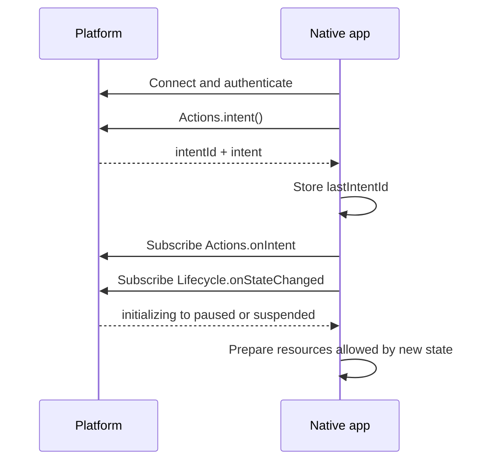
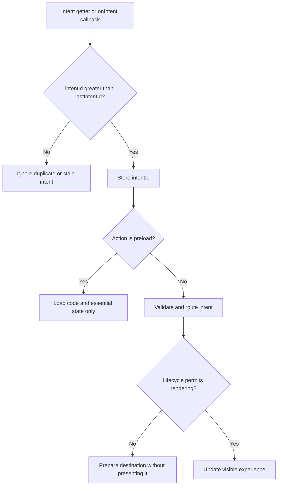

# Lifecycle and Intents for Native Firebolt Apps

**Lifecycle 2.0** defines when a native Firebolt app can use CPU, graphics, audio/video, memory, and network resources. **Intents** tell the app which experience to prepare when those resources are available.

The primary purpose of the Application Lifecycle on the platform is to enable fast application startup, resume, and switching, while ensuring robust platform operation and efficient resource utilization.

The platform owns lifecycle transitions. Your responsibilities as native app or runtime are:
**subscribe to lifecycle changes during startup, allocate only the resources allowed in each state, consume the newest intent, and release resources promptly when the app is deactivated or suspended.**

This page focuses on the native application or runtime integration steps. For the lifecycle model and the reasons behind each state, refer to the Lifecycle 2.0 specification.

---

## Native API surface

Use the following APIs for Lifecycle 2.0 onboarding:

| Module | API | App responsibility |
|---|---|---|
| `Lifecycle` | `onStateChanged` | Subscribe during startup and use notifications as the primary source of lifecycle state. |
| `Lifecycle` | `state` | Read the current state only when recovery or diagnostics require it. |
| `Lifecycle` | `close` | Ask the platform to deactivate, unload, or restart the app. |
| `Actions` | `intent` | Read the most recently received intent, including its monotonic `intentId`. |
| `Actions` | `onIntent` | Subscribe to intents delivered while the app has CPU. |

> [!IMPORTANT]
> Use the app-facing `Lifecycle` module for all Lifecycle 2.0 APIs.

---

## Startup contract

A native app starts in `initializing`. It remains there until it subscribes to `Lifecycle.onStateChanged`. Treat that subscription as the lifecycle handshake with the platform.

During cold launch or preload:

1. Read and use the environment variables provided by the AppContainer to initialize and configure your application. While in `initializing` state you can load resources such as code libraries and data files locally and via network but you MAY NOT yet allocate an EGL surface, GPU resources or an active AV session via Rialto. 
2. Load the `firebolt-cpp-client` library and connect to the endpoint specified by `FIREBOLT_ENDPOINT` env var ASAP : `Firebolt::IFireboltAccessor::Instance().Connect(...)` 
3. Upon successfull connection you now can talk with Firebolt App Gateway and use the Firebolt api, start with calling `Actions.intent()` and store its value and the returned `intentId` as the last received ID. If the intent value is `preload` you have strong hint that the platform will very likely transition you to `suspended` state in upcoming onStateChanged event.
6. Subscribe to `Actions.onIntent` and route newer intents through the same handler.
7. Subscribe to `Lifecycle.onStateChanged`. For the platform, this subscription serves as the lifecycle handshake with the application. Immediately after confirming this subscription method, the platform communicates the new Lifecycle state through an `onStateChanged` event. The new state is provided in the event payload.
8. Follow the first transition from `initializing` to either `paused` or `suspended`. 

Reiterating, do not allocate an EGL surface, GPU resources, or an active AV session while still in `initializing`.

> [!TIP]
> Keep startup callback wiring independent of the graphics surface. A direct-to-suspended preload must be able to complete without creating that surface.

---

## Handle lifecycle state changes

`Lifecycle.onStateChanged` provides a list containing exactly one change with `oldState` and `newState`. The notification is raised after the platform has moved the app to the new state.

Use one state handler and make each operation safe to repeat:

~~~cpp
void onStateChanged(const StateChange& change)
{
	switch (change.newState) {
	case LifecycleState::Paused:
		enterPaused();
		refreshLatestIntent();
		break;
	case LifecycleState::Active:
		enterActive();
		refreshLatestIntent();
		break;
	case LifecycleState::Suspended:
		enterSuspended();
		break;
	case LifecycleState::Hibernated:
		enterHibernated();
		break;
	case LifecycleState::Terminating:
		enterTerminating();
		break;
	default:
		break;
	}
}
~~~

The type and registration names in generated bindings can vary by SDK version. Keep the behavior and ordering shown here when adapting the example to your client library.

### `initializing` to `paused`

Prepare the app for a normal launch:

- Create the Rialto client, but do not start an active AV session yet
- Create the Wayland/EGL surface
- Load the minimal graphics required for a clean first frame
- Prepare animation resources, but do not run animations
- Process the latest intent and compose the requested experience
- Render a stable splash or first frame without exposing incomplete UI

The first committed frame makes the app eligible for activation. It does not itself mean that the app is active.

### `initializing` to `suspended`

This transition is used for supported direct-to-suspended preloads. Keep the app lightweight:

- Load code libraries and essential state only
- Do not create a Wayland/EGL surface
- Do not create a Rialto client or AV session
- Do not allocate GPU textures, vertices, shaders, or other graphics resources
- Do not render the intent destination

For a `preload` intent, defer the full experience. The platform will supply a newer, more specific intent before transitioning the app to `active`; do not assume it arrives before the app enters `paused`.

### `paused` to `active`

Treat the app as visible for lifecycle and resource handling. The platform may still decide when the prepared surface is presented:

- Confirm the newest intent with `Actions.intent()`
- Finish or update the destination requested by that intent
- Start animations and user interaction
- Create or resume active audio/video sessions
- Keep the prepared surface ready for the platform to present without replacing it with a blank frame

For an action that should wait until the app receives input focus, such as starting video requested by an intent, read `Presentation.focused()` and subscribe to `Presentation.onFocusedChanged`. These APIs report whether the app is receiving key presses.

### `active` to `paused`

The app is no longer visible:

- Stop animations and other continuous rendering work
- Stop or pause active AV as required by the app experience
- Keep the most recent UX state and surface available for a hot return
- Continue accepting newer intents and prepare their destination without showing it

### `paused` to `suspended`

Release resources promptly:

- Destroy the EGL surface
- Release GPU textures, buffers, vertices, shaders, and other GPU allocations
- Release the Rialto client and AV resources
- Reduce memory to the minimum needed for a hot launch
- Stop unnecessary timers, background work, and network activity

> [!NOTE]
> In `suspended`, the platform may limit CPU scheduling and network bandwidth, and the app must operate with a reduced memory footprint. Timers, callbacks, and network operations may therefore complete more slowly or less predictably. Do not rely on long-running or timing-sensitive work in this state, and make recovery operations safe to retry.

Do not depend on the platform to clean up native resources on the app's behalf.

### `suspended` to `paused`

Rebuild what was released:

- Recreate the Rialto client
- Recreate the Wayland/EGL surface
- Reload required GPU resources
- Call `Actions.intent()` and process the intent only when its `intentId` is greater than the highest `intentId` currently stored by the app
- Prepare and commit a stable first frame

The platform sets the new intent before this transition. Read it before rebuilding destination-specific UI.

### `suspended` to `hibernated`

Complete any short synchronous work needed for a reliable restore. GPU resources and the EGL surface must already have been released while suspended. Do not begin new asynchronous work.

### `hibernated` to `suspended`

The app may be hibernated for a short time or for an extended period. Restored in-memory state does not guarantee that external sessions, connections, or handshakes are still valid. After the process is restored:

- Refresh app-specific tokens, credentials, and other time-sensitive state
- Revalidate external sessions, sockets, and handshakes; recreate them when they expired or the remote side closed or discarded them
- Reconcile remote state that may have changed while the app was hibernated
- Remain within suspended resource limits
- Wait for the transition to `paused` before recreating graphics and AV resources

### Any state to `terminating`

The platform does not provide a guaranteed cleanup window and may stop the process immediately after the notification. Perform best-effort synchronous cleanup in priority order, placing the most critical operation first:

- Complete the most critical app-specific shutdown operation
- Stop AV and release critical native resources
- Flush critical telemetry only if it can complete immediately
- Skip nonessential work, network requests, and lengthy shutdown routines

Each completed step must be useful on its own. Do not assume the full cleanup sequence will finish or that another callback will arrive.

---

## Process the latest intent once

Both `Actions.intent()` and `Actions.onIntent` return an `intentId` and an intent JSON document. The ID is monotonic. Keep the greatest ID received and ignore the payload when its ID is less than or equal to that value.

Use the same handler for getter results and live events:

~~~cpp
uint64_t lastIntentId = 0;

void processLatestIntent(uint64_t intentId, const Json& intent)
{
	if (intentId <= lastIntentId) {
		return;
	}

	lastIntentId = intentId;
	routeIntent(intent);
}

void refreshLatestIntent()
{
	Actions::intent( {
		processLatestIntent(intentId, intent);
	});
}

void onIntent(uint64_t intentId, const Json& intent)
{
	processLatestIntent(intentId, intent);
}
~~~

Read and store the current intent before registering `Actions.onIntent` during cold launch. The app managers emit `onIntent` for every new intent; the ID check makes duplicate delivery harmless. Apply the same check whenever `Actions.intent()` is called after a state transition. Lifecycle notifications and intent delivery are asynchronous and may race: the getter result can duplicate an `onIntent` callback or arrive after a newer intent. Comparing `intentId` before processing prevents duplicate handling and stops a stale result from replacing newer navigation.

### Route by action

Validate the action and its required payload before changing app state. At minimum, handle the lifecycle-specific actions explicitly:

- `preload`: load code and essential state with the smallest possible resource footprint
- `launch`: preserve the previous UX unless a more specific destination is supplied
- `home`: prepare the app's home experience

Route other supported actions, such as entity, playback, search, section, or tune, through the same validated intent handler. Unknown or incomplete intents should produce a controlled fallback rather than a blank or partially rendered screen.

---

## Request app closure

Use `Lifecycle.close(type)` instead of terminating the process directly:

| Close type | Use when |
|---|---|
| `deactivate` | The user exits the app and the platform may keep it available for a hot return. |
| `unload` | The app must be deactivated and terminated, typically after an unrecoverable app error. |
| `killReload` | The app needs a clean process and may return to `paused` or `suspended`, according to platform policy. |
| `killReactivate` | The app needs a clean process and should be activated again. |

After calling `Lifecycle.close`, continue responding to lifecycle notifications until the platform transitions the app. Do not infer the final state from the requested close type.

---

## Native onboarding checklist

- Connect and authenticate the Firebolt client before registering callbacks
- Read `Actions.intent()` and store its `intentId`
- Subscribe to `Actions.onIntent`
- Subscribe to `Lifecycle.onStateChanged` to leave `initializing`
- Support both initial transitions: `initializing` to `paused` and `initializing` to `suspended`
- Keep graphics and AV allocation aligned with the current lifecycle state
- Re-read `Actions.intent()` after returning to `paused` and when becoming `active`
- Ignore stale or duplicate intent IDs
- Treat `preload` as code and essential-state preparation, not full rendering
- Release EGL, GPU, AV, and excess memory before remaining suspended
- Use `Lifecycle.close(type)` instead of exiting the process directly
- Attempt terminating cleanup synchronously in priority order; no cleanup window is guaranteed

---

## What good looks like

When Lifecycle 2.0 and intents are wired correctly:

- Cold launches and preloads follow the platform-selected initial state
- The app never creates a graphics surface during direct-to-suspended preload
- Hot and resumed launches display the destination from the newest intent
- Duplicate getter and event delivery never causes duplicate navigation
- Deactivation stops foreground work without discarding hot-launch state
- Suspension releases native graphics, AV, and memory resources
- Closure and termination remain controlled by the platform
